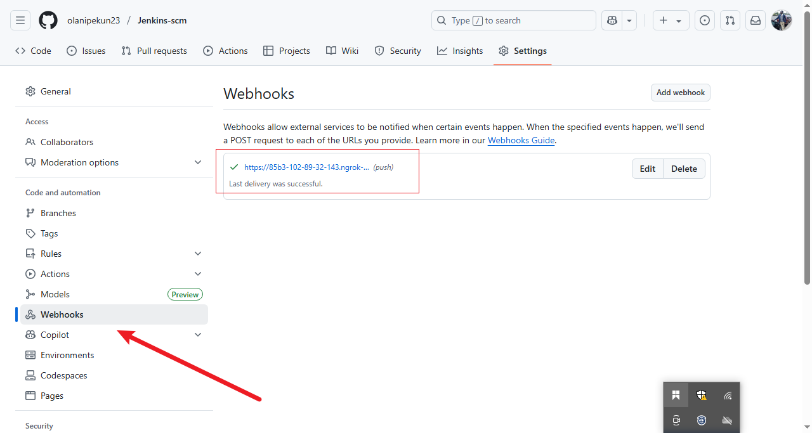

# Freestyle Project with Jenkins, GitHub & ngrok

This project demonstrates a full CI/CD workflow using **Jenkins**, **GitHub**, and **ngrok**. It includes Jenkins setup on WSL, secure webhook integration via ngrok, and an automated pipeline that responds to code changes in a GitHub repository.

---

## 🚀 Project Goals

By the end of this project, you will:

- Understand **CI/CD principles** and their role in modern DevOps.
- Install and configure **Jenkins** in a WSL (Ubuntu) environment.
- Create and manage Jenkins jobs and pipelines.
- Use **GitHub Webhooks** to trigger builds on code push.
- Securely expose your local Jenkins server to the internet using **ngrok**.
- Apply CI/CD best practices: parameterized builds, Docker integration, and automation.

---

## 🖥️ Technologies Used

- **Jenkins**
- **GitHub**
- **ngrok**
- **WSL (Ubuntu)**
- **Bash / Shell Scripting**
- **Java 11+**

---

## ⚙️ Setup Instructions

1. Project Directory.

2. My First Job

- Job created in Jenkins.

3. New Repository created in github Jenkins-scm

4. Configuration.

5. Gonfiguring Trigger.

6. Source Code Management with Github.

7. configuration saved.

8. Connected to Repository.

9. Creating a webhook.

10 Webhook Created in Github.

11. Delivery Successful.

